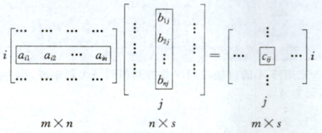
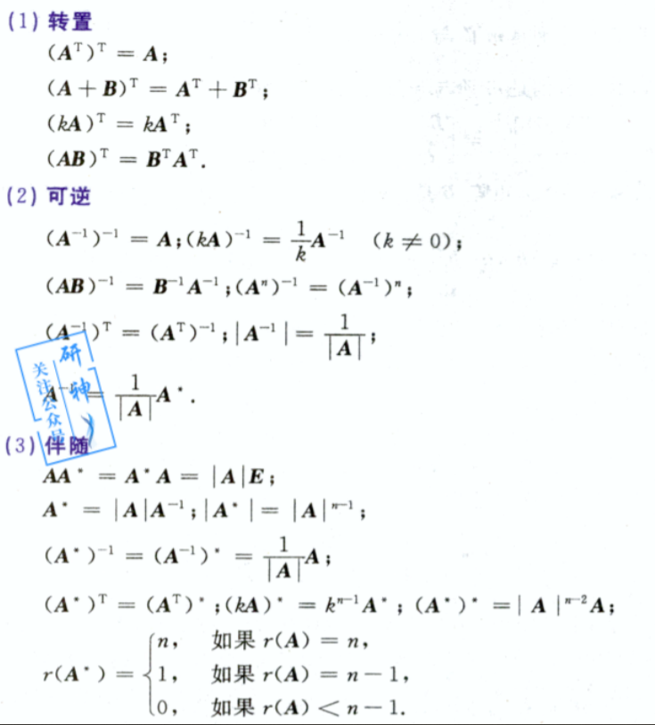
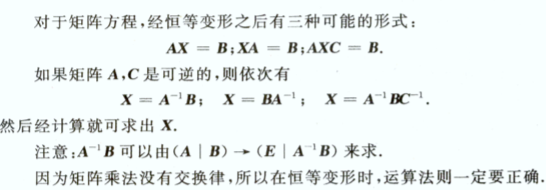
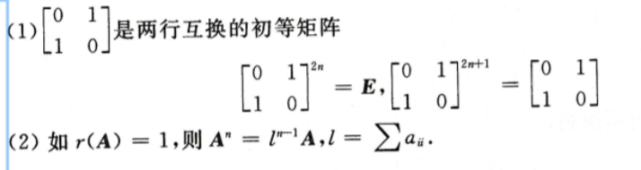
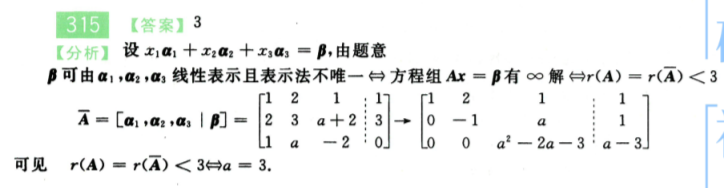
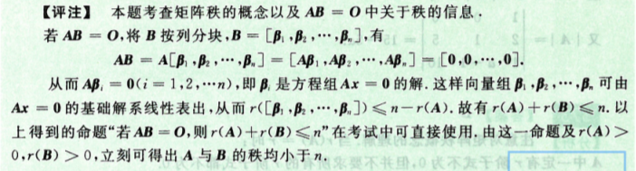

# 3-矩阵

> 序言

正如之前所说，线性代数先了解定义，根据定义熟悉如何推导公式，运用技巧和特征解题

- 概念  m行n列的表格，表示的时候尽量使用数学表示，这样更加**方便和表达抽象**
- 矩阵（性质）运算
  - 矩阵相加 相同行、相同列才可以运算
  - 常数乘以矩阵，常数前不能为复数（高等代数的一种定义）
  - 矩阵相乘  比如$AB$ 实际上代表$B$中的每一个列向量进行$A$矩阵变换，得到每一个列向量的组合
- 初等变换
  - 在单位矩阵的基础上，进行一下操作
    - 矩阵中行(列)互换
    - 矩阵乘以一个常数
    - 矩阵的某行(列)加上本矩阵其他行(列)的$k$倍
  - $A$矩阵初等变换为$B$,则$A$  $B$等价，记为$A \cong B$
  - 初等矩阵$P$左乘$A$ ,代表对$A$进行一次与$P$同样的行变换
  - 初等矩阵$P$右乘$A$ ,代表对$A$进行一次与$P$同样的列变换
  - $A$矩阵初等变换为$B$,  $\Longleftrightarrow PAQ=B$,其中$P、Q$可逆
- :grey_question:逆矩阵
  - 唯一性（证明唯一，一般使用反证法。先假设不唯一）
  - 增广矩阵求逆矩阵
  - $A^{-1}=\frac{1}{|A|}A^*$
- :pray: 逆矩阵、伴随矩阵等矩阵的推导  不太熟练

> 基本内容

使用mxn个数排列成m行n列表格，称之为mxn矩阵。当m=n时，矩阵A称之为n阶矩阵或n阶方阵。

- 矩阵加减法满足（通过定义推导）：
  - $A+B=B+A$
  - $(A+B)+C=A+(B+C)$
  - $A+B=O$
  - $A +(-A) = O$ 这里注意，矩阵中没有"减法"
  - $k(lA) =(kl)A$
  - $k(A+B) =kA+kB$
  - $(k+l)A = kA + lA$

- 矩阵相乘：设$A=[a_{ij}]$是m x n 矩阵，$B=[a_{ij}]$ 是 n x s 矩阵，那么 m x s 矩阵 $C=[c_{ij}]$,其中
  $$
  c_{ij}=\sum_{k=1}^{n} a_{ik}b_{kj}
  $$
  称为$A$与$B$的乘积，记为$C=AB$

  图示：

  

乘法法则有：

- $A(BC)=(AB)C$
- $A(B+C)=AB+AC,(A+B)C=AC+BC$
- $(kA)(lB)=klAB$
- $AE=A,EA=A$
- $OA=AO =o$

注意：

- :nail_care: 矩阵乘法没有交换律
- $AB=O$ 不能推导出 $A=O 或 B=O$
- 由$AB=AC,A\neq O$ 不能推出 $B=C$

> 伴随矩阵$A^*$、转置矩阵$A^T$、 逆矩阵$A^{-1}$、正交矩阵

伴随矩阵： 设$A$ 为$[a_{ij}]$是n阶矩阵，行列式$|A|$ 的每个元素$a_{ij}$的代数余子式$A_{ij}$所构成矩阵称之为$A$的伴随矩阵

转置矩阵：矩阵$A$的行换成同序数的列得到一个新矩阵，称之为矩阵$A$的转置矩阵，记为$A^T$

逆矩阵:  设$A$是n阶矩阵，如果存在n阶矩阵$B$,使得$AB=BA=E$成立，则称$A$为**可逆矩阵或非奇异矩阵**，$B$是$A$的逆矩阵。

$n$阶矩阵$A$，如果满足$AA^T =A^TA=E$,则为正交矩阵。$A是正交矩阵\longleftrightarrow$ $A^T=A^{-1}$  $A是正交矩阵\longrightarrow$ $|A|^2=1$

> 主要公式

> 习题总结

- 如果$AB=C$，$r(C)=1$,则$A$ $B$可以分别使用一个行向量和一个列向量表示。
- 若$P^{-1}AP=B$,则$A^n =PB^n P^{-1}$
- 如果没有思路的情况，可以考虑加入单位矩阵进行变换。多使用构建同类项
- 矩阵进行行列变换会改变矩阵的属性

> 注意：

> 练习题

`287-289`  需要弄清楚矩阵的变换，不能之间对矩阵的行列相加减，这个要特别注意。

`289-303` 涉及矩阵变换问题，利用增广矩阵来求逆矩阵。秩大小与求解问题

`304-320`  在这里要注意矩阵需要化简到最简式，**线性相关代表行列式为0**

有解的前提是矩阵A的秩要等于增广矩阵的秩

`353-378` 这里要注意的是伴随矩阵的定义，大错特错了。 这里要注意的是`矩阵没有结合律`

$A、B$可逆，$A+B$ 不一定可逆，$(A+B)^{-1}$ 一般也不等于 $A^{-1} +B^{-1}$

对称矩阵根据定义来验证是否是转置矩阵

初等矩阵的定义是单位矩阵**一次初等变换**就可以得到

这里不太懂

> 总结与思考

经过长达一天半的学习过程，对于矩阵的表示更加熟练了。发现了一直脑海里定义错误的东西，比如伴随矩阵，一直是以为代数余子式就可以。还有对于矩阵中秩的相关问题也不太熟练，比如$AB=O$ 时，为什么$R(A)+R(B)$ 小于等于 $n$ 。

对于第一节课程的知识点有了更加熟练的掌握，比如逆矩阵与伴随矩阵之间的运算方式，对于行变换、列变换如何使用矩阵表示更加熟练，对于矩阵变换中，直接修改行列式有了更加清晰地的看法。不懂的还有很多。

矩阵没有交换律这个在学习过程中也经常涉及，后面的话，草稿纸要有逻辑性。

要多从方程、变换的思想理解矩阵。 