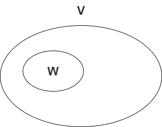

# 4-向量空间

> 向量空间的概念（这里口太定义，不太准确。）

$F$ 是一个数域，集合$V$是一个向量的集合:

1. 两个向量相加成为另一个向量，且也在数域中。

2. 数乘之积也在集合中

3. 同时满足以下性质：
   - $\alpha + \beta = \beta +\alpha $
   - $\alpha + \beta +\gamma = (\alpha + \beta) +\gamma$
   - 在$V$ 中存在零向量，记住$\vec0$,对于 任意向量$\vec \alpha$,满足 $ \vec0 + \vec \alpha = \vec\alpha$
   - $\vec\alpha + \vec{\alpha^{’}} = \vec{0}$  ,则 $\vec{\alpha^{’}}$ 称之为负向量
   -  $a(\vec \alpha + \vec \beta) = a\vec \alpha + a\vec \beta$
   - $(a+b)\vec{\alpha}=a\alpha+b\beta$
   - $ab\vec{\alpha} = a(b\vec{\alpha})$
   - $1\vec{\alpha}=\vec\alpha$

满足以上以上三大点，我们称之集合$V$ 为**向量空间**

   

   行向量 $\rightarrow$ $n$ 元行空间； 列向量 $\rightarrow$ $n$ 元列空间；  均可以使用$F^n$ 表示

   向量空间中$\vec{0}$ 是唯一的，$\vec\alpha$ 的负向量是唯一的。（**唯一性一般使用反证法来证明**）

注意：$\vec\alpha + \vec{\alpha^{’}} = \vec{0}$  中 $\vec{\alpha^{’}} = - \vec{\alpha}$  这里不是代表$-1 \times \vec{\alpha} $

> 子空间

设$V$ 为 数域(这里代表实数) $F$中的一个空间， $W$ 是 $V$ 的非空子集，设$\vec{\alpha},\vec{\beta}$在 $W$空间中，如果$\alpha + \vec \beta$,也在$W$ 中，则对于$V$而言，$W$是封闭的。同理可以拓展到数乘，如果 $a\vec{\alpha}$在$W$中，则对于$V$而言，$W$是封闭的。

子空间：如果$W$ 在数域$F$上的向量空间是一个非空子集，如果$W$在$V$上加法，标量与向量的乘法是封闭，那$W$本身也在数域$F$上的向量空间。

一个向量空间$V$本身和零空间叫做$V$的`平凡子空间`

子空间的交集还是子空间，但是子空间的并集不一定是子空间，子空间的加法一边是子空间。子空间可以用套娃来形容。

> 线性表示

向量组一般是有限的，零向量可以被任意组向量线性表示。

线性表示——>平行；  线性无关——>相交（只有等全部为0，才平行）；

零空间和其他向量全为线性相关

`向量组等价`的概念，向量组等价有传递性。

:star:替换定理：$(\alpha_1,\alpha_2,\dots,\alpha_r)$线性无关，可以由$(\beta_1,\beta_2,\dots,\beta_s)$线性表示。则$r\leq s$.

> 基和维度

`生成元`概念

基（一个向量空间的基不止一个）：

1.  基里面的向量都线性无关
2. $V$ 每一个向量都可以由基中的向量表示

标准基

**向量组是有限的，向量空间是无限的**

空间的维度：

- 零空间维度为0，$V_2$ 维度为2，$V_3$维度为3，$F^n$维度为$n$,$F$上的一切$m\times n$矩阵所成向量空间维度为$m\times n$
- 无限维空间

> 坐标

这里坐标的含义和平面直角坐标系类似，可以根据平面直角坐标系和极坐标之间的关系来辅助理解。

`过渡矩阵`的概念和含义，涉及到矩阵运算。

> 习题

基础解系求解：首先先求出极大无关组有多少个，根据极大无关组的数量确定基础解系有多少个。最好是使用(1,0,0)代表其中的一个基础解系。

如果不能判断t的大小，可以考虑使用行列式计算

在判断个数的增加减少的时候，需要注意的是。向量个数的增加和向量分量的增加意思是不相同的。多多使用数形结合的方式。

`自由变量` `特解`

> 总结

这一次完成了线性代数的向量空间部分。对于线代和矩阵的表示有了更深的了解。线性相关、线性无关的情况与矩阵的关系更加清晰了。这段时间也不断加深左乘为行变换、右乘为列变换。线性相关无关性主要是通过化简矩阵、数行结合的方法、回归到基本的定义来处理。

哈哈哈，差不多要做英语作业了。