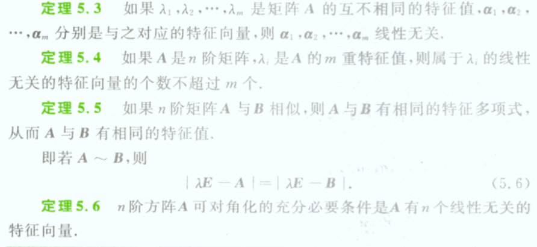
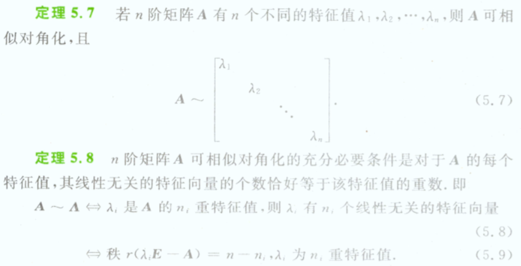
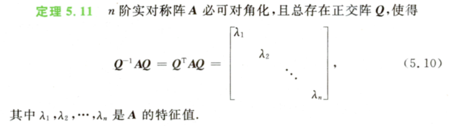
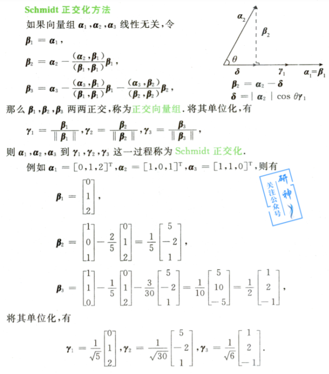

### 5. 特征值和特征向量

定义：设$A$是$n$阶矩阵，如果存在一个数$\lambda$及其非零的$n$维列向量$\alpha$,使得
$$
A\alpha = \lambda \alpha
$$
成立，则称$\lambda$是矩阵$A$的一个**特征值**，称非零向量$\alpha$ 是矩阵$A$属于特征值 $   \lambda$的一个特征向量。

设$A$=[$a_{ij}$]为一个$n$阶矩阵，则行列式$|\lambda E-A|$称为矩阵$A$的特征多项式，$|\lambda E-A|=0$ 称之为$A$的特征方程。

设$A$ 和$B$ 都是$n$阶矩阵，如果存在可逆矩阵$P$，使得
$$
P^{-1}AP=B
$$
则称矩阵$A$与矩阵$B$相似，记作$A  $ ~   $B$。

特别的，如果$A$能与对角矩阵相似，则称$A$可对角化。

相识具有：

1. 反身性： $A$ ~ $A$
2. 对称性： $A$ ~ $B$     $B$ ~ $A$ 
3. 传递性： $A$ ~ $B$,  $B$ ~ $C$,  则 $A$ ~ $C$

重要定理：

1. 当$\alpha_1,\alpha_2, \dots,\alpha_t$ 都是矩阵$A$的属于特征值$\lambda$的特征向量，那么当$k_1\alpha_1+k_2\alpha_2+\dots+k_t\alpha_t$非零时，$k_1\alpha_1+k_2\alpha_2+\dots+k_t\alpha_t$ 仍然是矩阵$A$属于特征值$\lambda$的特征向量。

2. 设$A$是$n$阶矩阵，$\lambda_1,\lambda_1,\dots,\lambda_n$ 是矩阵$A$的特征值，则

   - $\sum\lambda_i=\sum a_n$
   - $|A|=$$\prod \lambda_i$

3. 

4. 

5. 实对称矩阵$A$的特征值都是实数

6.  

7.  施密特正交化：

   

   

> 课本题目

- 课本的题目主要偏向于定义求出
- 对于特征向量、特征值理解不是很到位，需要多多做题

> 反思

没有萌哥课程直播，很多题目都不是很会，难顶。特征向量和特征值发掘其几何体现的意义重要，特征值对原特征向量的拉伸。在知乎上，特征值在计算机图形学应用中可以很大程度上提取关键信息。

对于矩阵相似的理解不太到位。