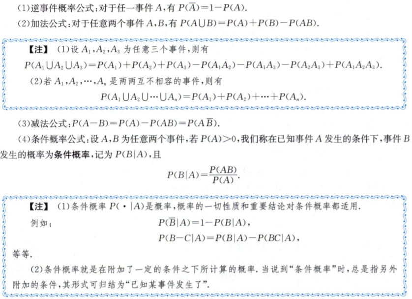
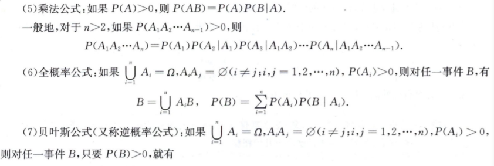
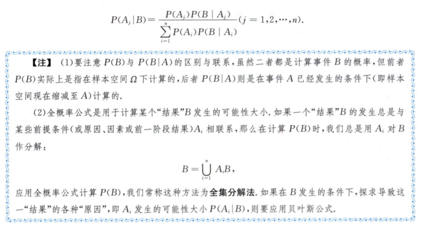
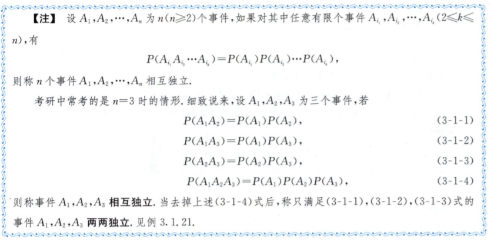
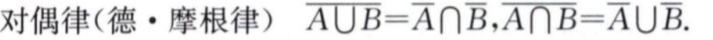
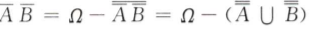

# 6.随机事件与概率

> 古典概型和几何概型

1. 称随机试验(随机现象)的概率模型为**古典概型**，如果其样本空间(基本事件空间)满足： 
   1. 只有**有限个样本点**(基本事件)； 

   2. 每个样本点(基本事件)发生的可能性都一样.

      如果古典概型的基本事件总数为"，事件A包含怡个基本事件,也叫作有利于A的基本事件为$k$个, 则A的概率为$P(A)=\frac{k}{n}=\frac{事件A所含基本事件的个数}{基本事件总数}$

2. 称随机试验(随机现象)的概率模型为**几何概型**,如果

   1. 样本空间(基本事件空间)0是一个**可度量**的**有界区域**;

   2. 每个样本点(基本事件)发生的可能性都一样，即样本点落入。的某一可度量的子区域$S$的可能性 大小与$S$的**几何度量成正比**，而与$S$的位置及形状无关.

   3. 在几何概型随机试验中，如果$S_a$是样本空间$\Omega$的一个可度量的子区域,则事件$A$=｛样本点落入区域 $S_a$｝的概率为
      $$
      P(A)=\frac{S_a的几何度量}{\Omega的几何度量.}
      $$
      由上式计算得出的概率称为A的几何概率.

> 概率的基本性质与公式

1. 性质
   - 有界性：对于任一事件$A$,有0$\leq$P(A)$\leq$1,且 P($\emptyset$)=0,$P(\Omega)$=1
   - 单调性:设A,B是两个事件，若AUB,则有 P(B-A)=P(B)-P(A), P(B)$\geq$P(A).
2. 公式
   - 
   - 
   - 

> 事件独立性

1. 事件的独立性
   1. 设A,B为两个事件，如果其中任何一个事件发生的概率不受另外一 个事件发生与否的影响，则称事件A与B相互独立.
   2. 设A,B为两个事件，如果P(AB)=P(A)P(B),则称事件A与E相互独立,简称为A与B独立.
   3. 

> 习题

- 做题的时候发现，第三题中的，对偶律十分不错，以前没有涉及过。这里记录一下： 
- 概率恒等运算有点东西  
- 贝叶斯公式，逆概率公式

> 总结

时间关系，没有在规定时间打卡。这一种在机器学习算法过程中的独立性和贝叶斯分布比较重要。

对于贝叶斯的掌握不是很熟练，概率论中的很多知识点都在高中有所涉及（大学白学了）。重点熟练掌握全概率公式和贝叶斯分布的知识。

群公告
Task05：随机事件与概率（2天） 

截止时间 10月25日03:00 

作业：（张宇的）
第一章 随机事件和概率强化训练
（选择题）
条件概率：1、4；
事件独立性：2、13、15；
事件相容性：3、6、12；
事件表示：5；
求概率：7、8、9；
事件概率大小关系：10、11、14；
（填空题）
求概率：16、17、18、19、20、21、22、23、24、25；
（简答题）
求概率：26、27、28、29、30、31、32、33、34、35；
巩固提高
（选择题）
条件概率：1；
求概率：2、3、6；
独立性：4；
事件概率大小关系：5；
填空题：7；
（简答题）
求概率：10、11. 

视频课程：
https://www.bilibili.com/video/BV15L4y167JE