# 7.一维随机变量及其分布

> 随机变量及其分布函数的概念、性质及应用

1. 随机变量的概念：

   1. 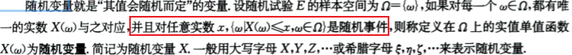

2. 分布函数的概念及其性质

   1.  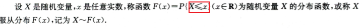

   2. 性质：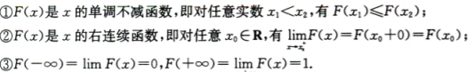

      以上三个性质也是判断函数$F(x)$是否为某一随机变量$X$的分布函数的充要条件。

3. 分布函数的应用——求解概率

      1. 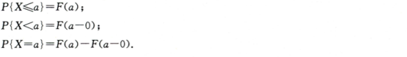

总结：这里分布函数的概念理解错误，需要重点理解

> 常见的两类随机变量——离散型随机变量和连续型随机变量

1. 离散型随机变量及其概率分布

   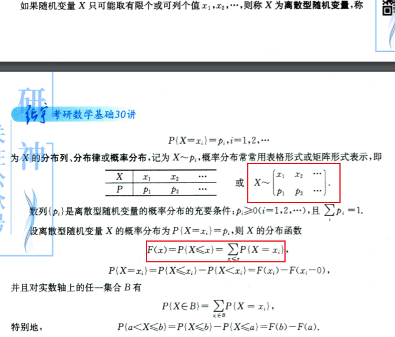

2. 连续型随机变量及其概率密度

   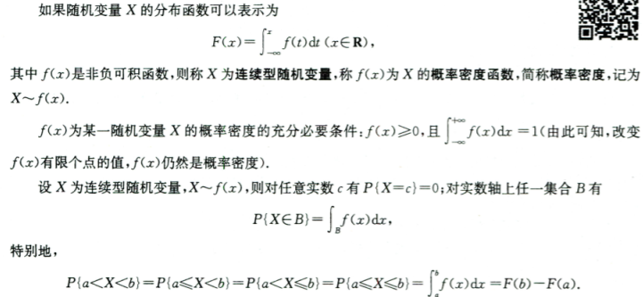

> 常见的随机变量分布类型

1. 离散型

   1. 0-1分布 B(1,p)
      1. 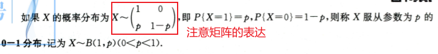
   2. 二项分布$B(n,p)$
      1. 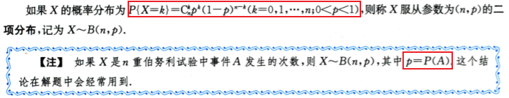
   3. 泊松分布$P(\lambda)$——它实质上为二项分布的特例，当$n$很大，$p$很小的时候转换而来。
      1. 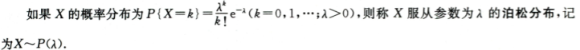
   4. 几何分布——放回球栗子
      1. 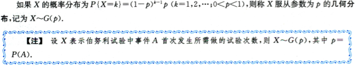
   5. 超几何分布
      1. 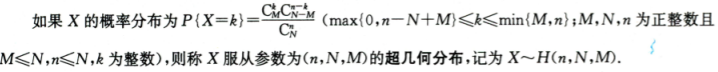

2. 连续型

   1. 均匀分布：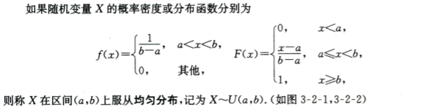

      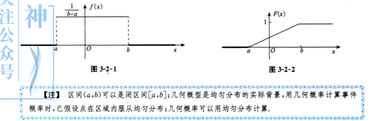

   2. 指数分布$E(\lambda)$

      1. 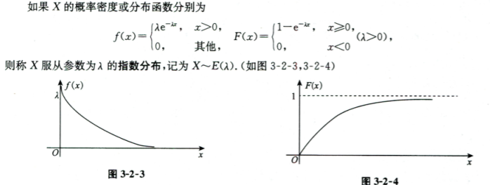

   3. 正态分布$N(\mu,\sigma ^2)$

      1. 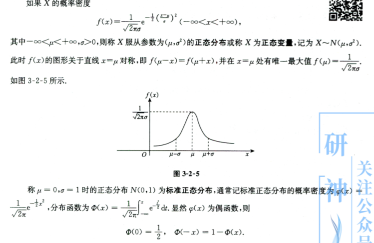
      2. 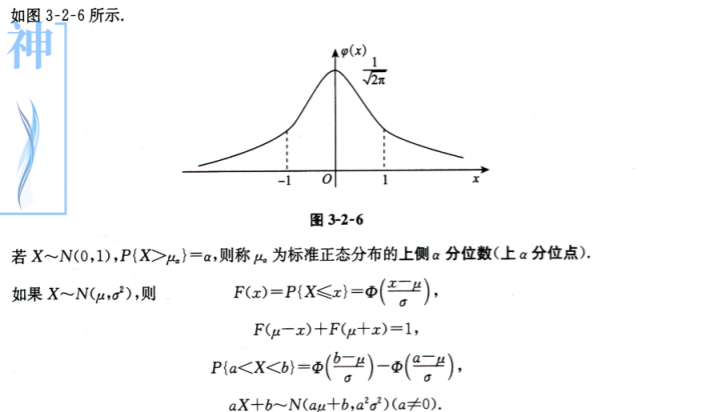

> 一维随机变量函数的分布

1. 概率：

   1. 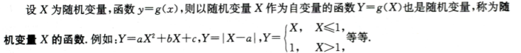

2. 随机变量函数的分布

   1. 离散型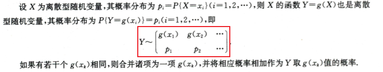

   2. 连续型

      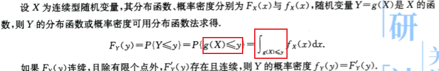

> 练习题

- 主要 `分布函数`  与  `概率密度` 不要混淆了
- [指数分布  还tm有无记忆性](https://www.zhihu.com/question/36965252)，学到了，学到了
- [二项分布、泊松分布和正态分布的区别及联系](https://www.zhihu.com/question/36214010/answer/208718886)

> 总结

这一章节一维随机变量比较简单，主要是围绕离散型随机变量、连续型随机变量而来。有很多高中学习的知识，比如几何分布、超几何分布、泊松分布、正态分布、指数分布、0-1分布。指数分布有无记忆性，我查看了一下，马同学说的沉没成本真的是笑死我了。这一节还考察了求导、微积分的知识，有待加强。并且很多概率论知识都是相互关联的，比如泊松分布与几何分布。

