# 8.多维随机变量及其分布

> 二维（n维)随机变量及其分布函数

1. 多维随机变量的概念
   - 如果$X_1$,$X_2$,$\dots$,$X_n$是定义在同一样本空间$\Omega$的$n$个随机变量，则称($X_1$,$X_2$,$\dots$,$X_n$)为$n$维随机变量或$n$维随机向量，$X_i$称之为第$i$个分量。
   - 当$n$=2时，记作$(X,Y)$为二维随机变量（或二维随机向量）
2. 多维随机变量的分布函数的概念和性质
   1.  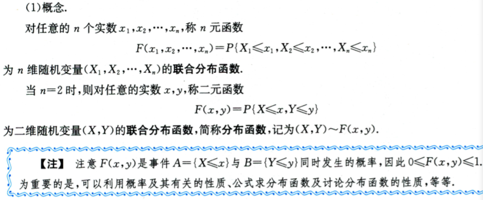
   2.  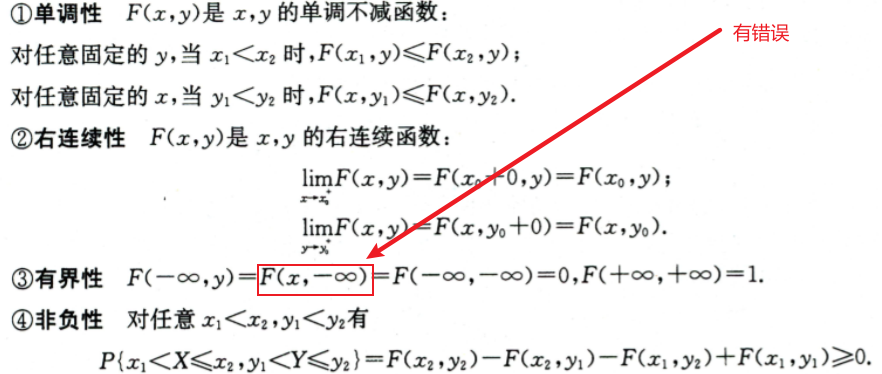  箭头处没有错误
   3.  边缘分布函数
      1. 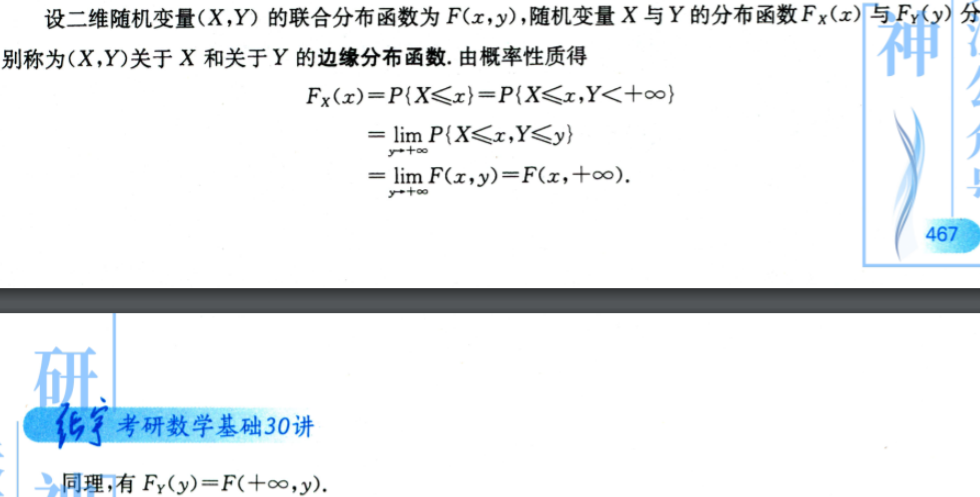

> 常见的两类二维随机变量——离散型随机变量和连续型随机变量

1. 二维离散型随机变量的概率分布、边缘分布和条件分布

   - 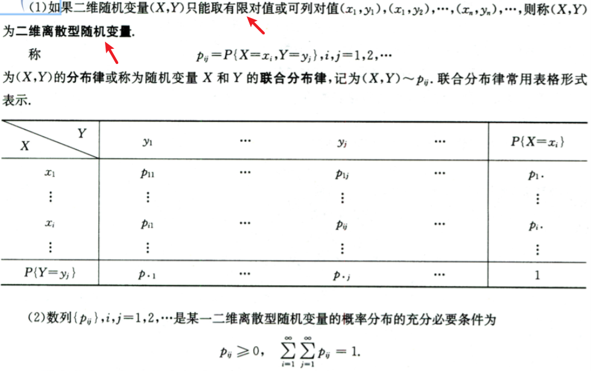

2. 联合分布函数、边缘分布、条件分布

   1. 联合分布函数

      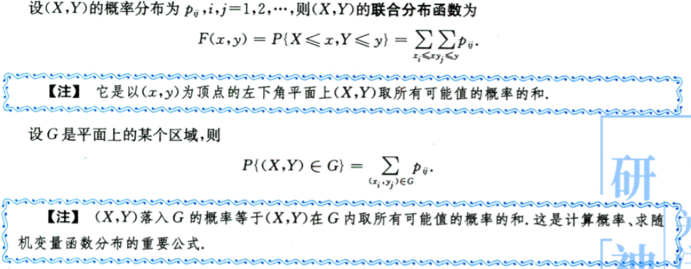

   2.  边缘分布

      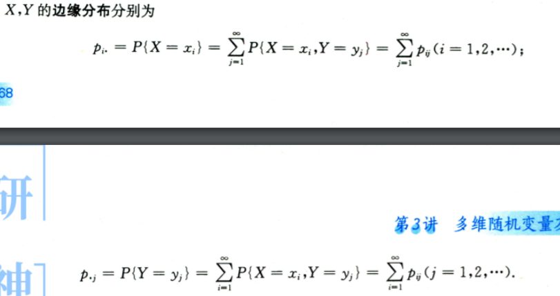

   3.  条件分布

      1. 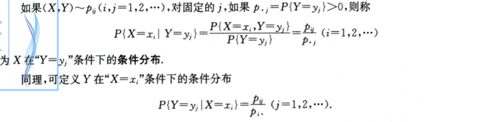

3. 二维连续型随机变量的概率密度、边缘概率密度和条件概率密度

   1. 概率密度
      1. 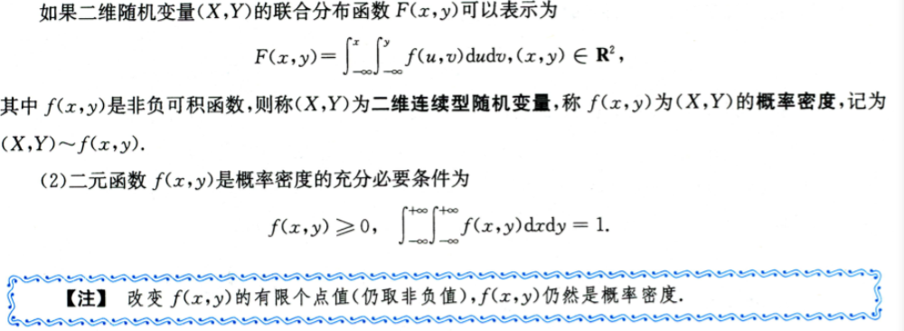
   2. 联合分布函数与概率密度、边缘概率密度、条件概率密度
      1. 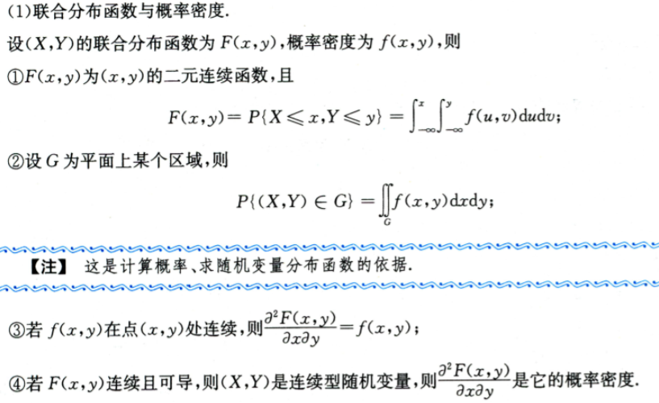
      2. 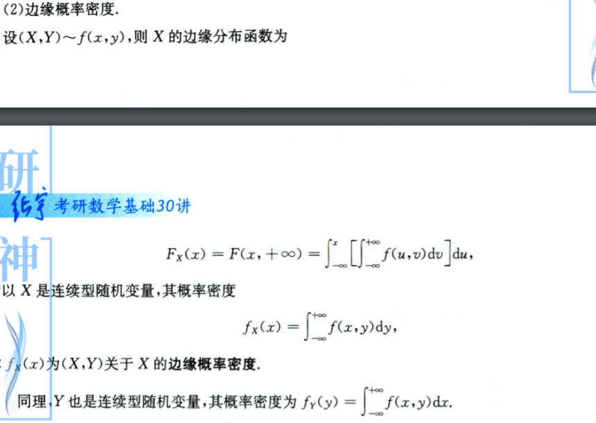
      3. 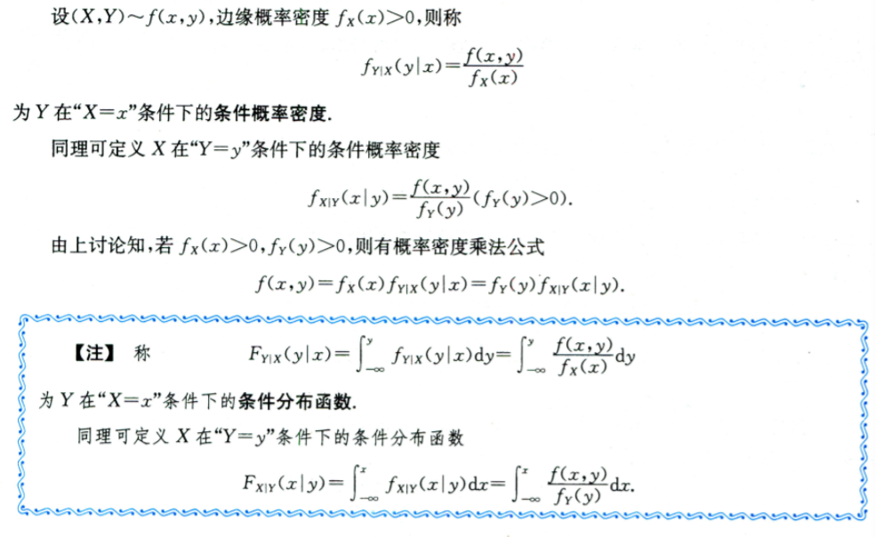

4. 常见的二维分布

   1. 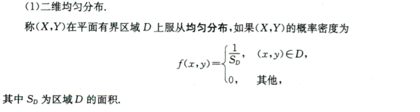
   2. 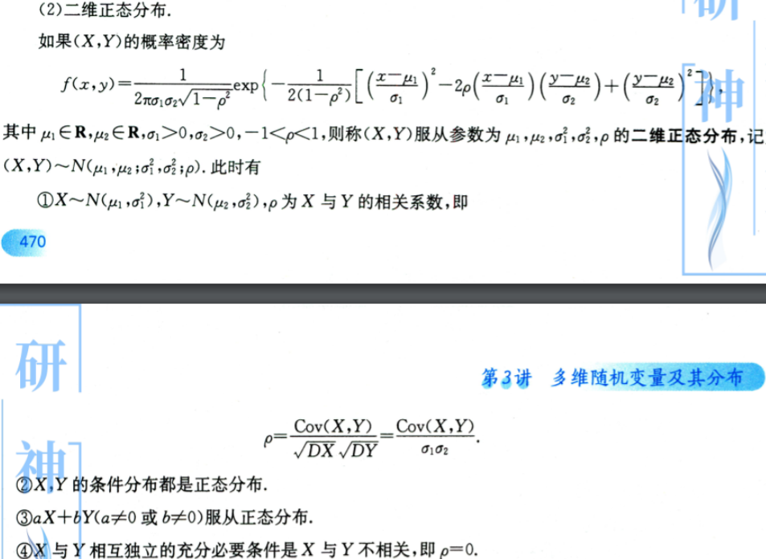

> 随机变量的相互独立性

1. 概念

   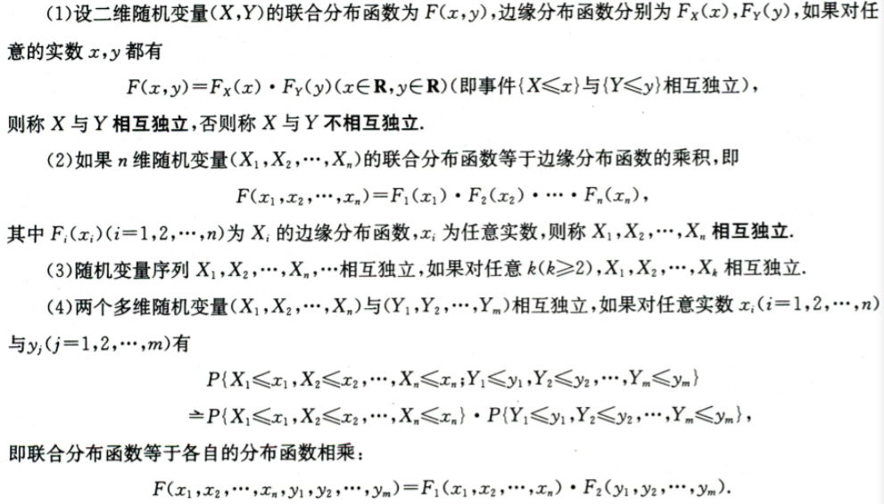

2. 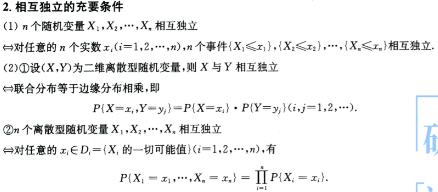

   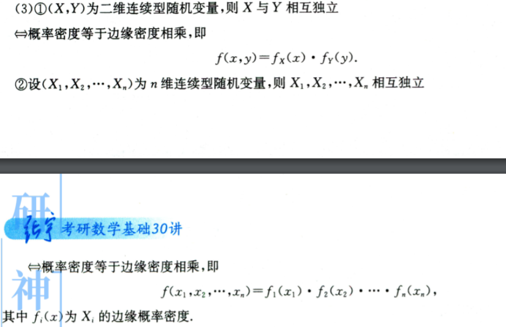

3. 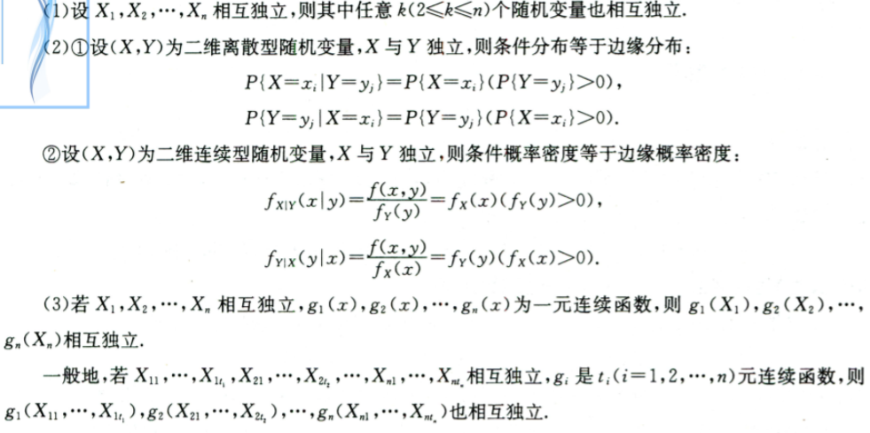

> 多维随机变量函数的分布

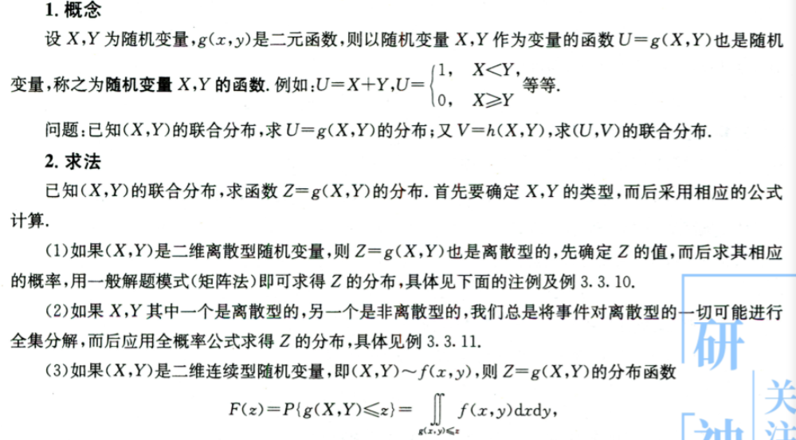

- 相互独立随机变量函数的分布及其卷积公式
  - 和的分布
  - 差的分布
  - 积的分布
  - 商的分布
  - max{X,Y}分布
  - min{X,Y}分布
  - 常见分布可见性

> 练习

练习重点考察了分布函数、边缘函数等其他情况，对于多维随机变量和高等数学考察比较多。这方面做题不太会，需要重点补救一下。

> 总结

多维随机分布相对一维随机分布更加复杂，多了很多求导、微积分方面的操作。这些操作不太友好。特别是这个要加深一下情况。差不多要结束打卡了，加油冲。相互独立随机变量函数的分布及其卷积公式中范围问题比较细节，对多重积分需要有更为深度的了解。