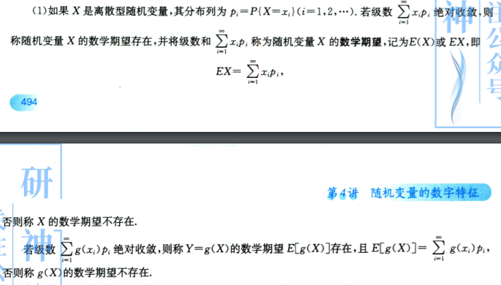
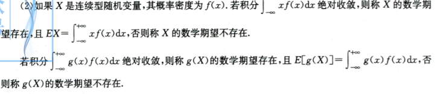
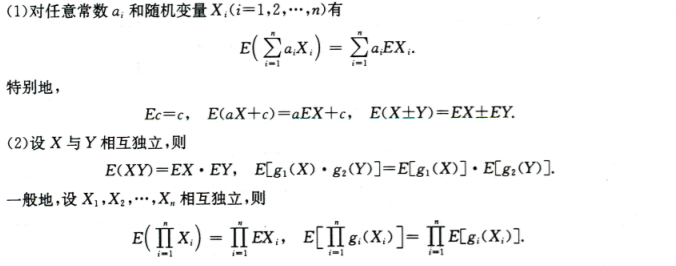
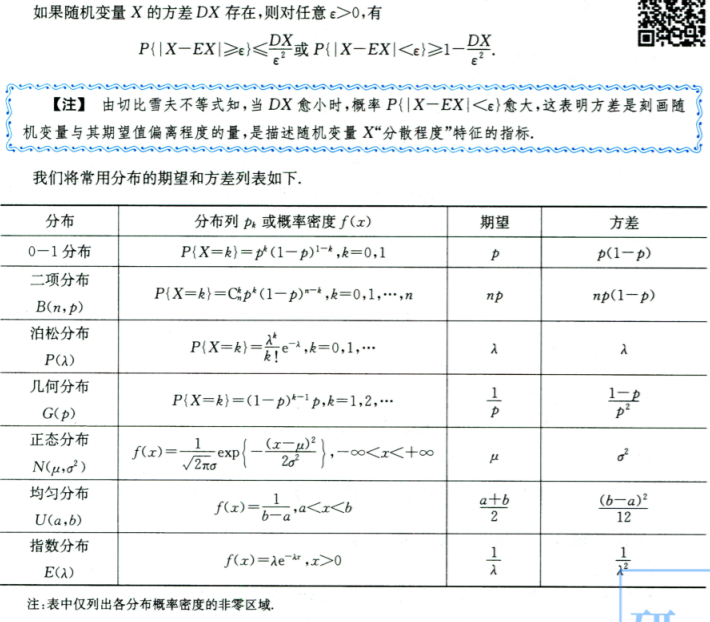
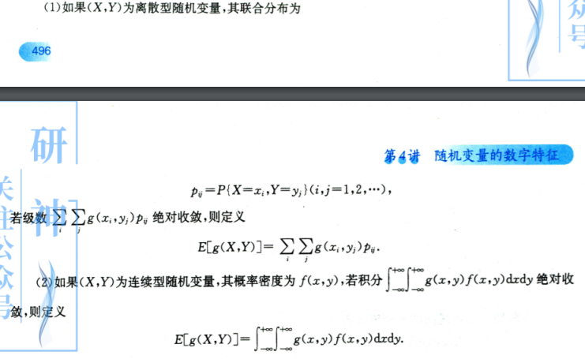
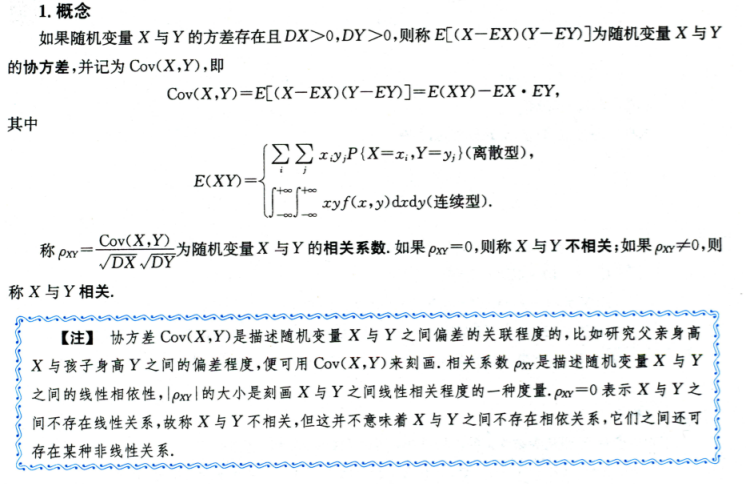
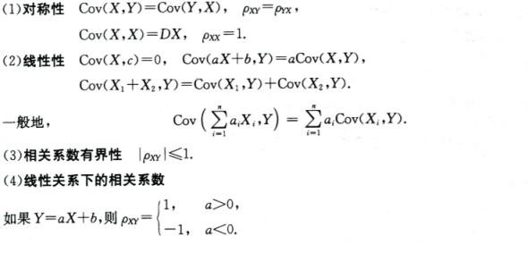

### 随机变量的数字特征

#### 一维随机变量的数字特征

1. 概念

   设$X$随机变量，$Y$ 是$X$的函数，$Y=g(X)$

   - 
   - 

2. 性质

   - 

##### 随机变量的方差、标准差、切比雪夫不等式

1. 概念
   - 
2. 性质
   1. 
3. 切比雪夫不等式
   1. 

#### 二维随机变量的数字特征

##### （一） 二维随机变量函数的数学期望

- 

##### 两个随机变量的协方差与相关系数

1. 概念

   

2. 性质

   

