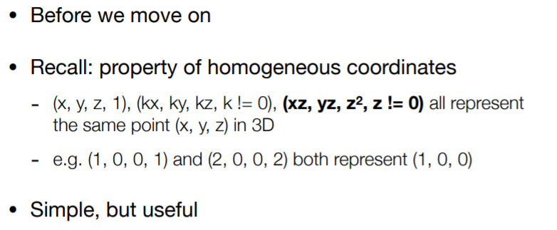
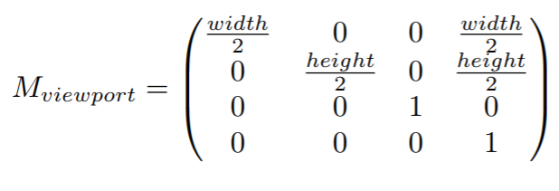
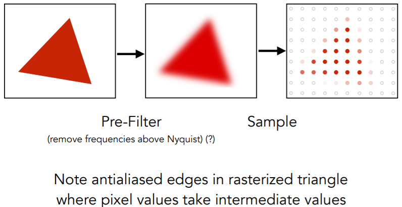
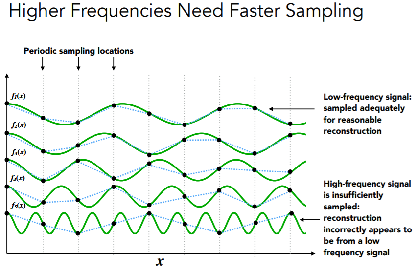

# 高级计算机图形学二

> Lecture 04 Transformation Cont.

如果对矩阵进行顺时针旋转$\theta$角度，那应该怎么样表示。还是使用特殊值带入可以得到。我们发现更好是逆时针旋转$\theta$角度的逆矩阵。在数学上，一个矩阵的逆矩阵恰好是该矩阵的话，我们称之为正交矩阵。

- 概述

  - 3D  变换
  - 观测变换
    - 视图/相机 变换
    - 投影变换 
      - 正交投影
      - 透视投影

- 3D 变换

  - 

  - 

  - 

  - 如果**绕着坐标轴旋转**，变换如图所示。注意绕$y$轴旋转的话，有点不一样。原因是之前说叉乘确定方向是右手定则，$x$ 与$z$ 叉乘得到的向量与$y$轴方向相反，使用$y$轴的变换矩阵比较特殊（$y$是由$\vec{z}$ 叉乘$\vec{x}$得到）。

    绕着一个坐标轴旋转，其所属坐标保存不变，其他坐标转换为2D旋转模型。

  - 

  - 一般旋转

    - 我们能否使用绕轴旋转的组合得到一般旋转？

      

    - 一般旋转通用公式：

      公式证明过程：

      

      - 和2D变换相似，我们的旋转是默认原点旋转。首先我们讲其平移到原点，然后进行旋转，然后再平移到目标位置。
      - 拓展：老师建议学有余力的同学可以考虑了解`四元数`知识

- View/ Camera Transfomation

  - 

  - 如何完成视图变换

    - 首先定义相机

      - 位置
      - 朝向
      - 旋转方向

      

    - 关键观察

      

    - 通过$M_{view}$矩阵改变相机

    - 首先通过平移移动到原点坐标，变换为$T_{view}$;把$t$轴放置到$y$轴，把$g$轴放置到$-z$轴，但是直接映射不太好写，如果放过来，把$x、y、z$轴发过来的话，比较方便，然后进行逆变换：

      旋转变换矩阵是正交矩阵，其逆矩阵为它的转置矩阵。

    - 

- Projection transformation

  - 有两种投影，一一种是正交投影，一种是透视投影

  - 

  - 正交投影

    

    

    把$Z$扔掉，这所有的平面都在$x$ $y$ 平面上，然后把结果变成[-1,1]范围。

    问题： 如何判断前后面？

  - 如何把物体映射到正交平面

    

    

    转换为矩阵变换的表示，先平移再调整规格：

    

    

    

    因为选定的坐标轴使用右手定则，所以远近的方面恰好相反。

    OpenGL使用的$Z$轴和我们这里假定的相反，所以出现相反的结果是合理现象

  - 视图投影——使用最广泛的投影
  
    
  
  - 在同一平面内，两个平行线不会相交。但是在透视投影中，平行线是会相交的。
  
  - 
  
  - 如何做视图投影
  
    - 挤压Frustum挤压成Cuboid
  
    - 
  
    -  给定$y$变化可以得知变换，最后推广到$x、z$
  
    - 
  
    - 
  
      根据$x、y、z$如何变换，可以得到矩阵$M_{persp->ortho}$ ,只剩下第三行不知道。
  
    - 
  
      近的平面上任何点不会变换，远的平面$z$轴的点不会变换
  
    - 
  
      上图中，在近端$x,y$保持不变。所以$(0\space \space 0 \space \space A \space B)$
  
    - 
  
    - 列方程解出$A\space B$。这一步完成了解压操作，把平面挤压成了正交投影；之后进行正交变换。这样的结果可以得到最终变换。

> Lecture 05 Rasterization 1 (Triangles)

垂直的可视角度，这样可以描述一个相机侧面的视野的大小，使用field-of-view(fovY)来形容

如何使用可视角度来形容l,r,b,t?如图：

- 

- MVP

  - Model transformation  放置物体
  - View transformation 放置相机
  - Projection transformation
    - 正交变换 转到$[-1,1]^3$
    - 视图变换 物体转到正交变换

- MVP变换之后要转移到屏幕上

  - 屏幕：像素构成、有一定分辨率
  - 光栅： 屏幕
    - `光栅化`：**投影到屏幕**

  

- 定义屏幕空间

  

- 像素这里表示和$z$轴无关，我们只要把$xy$平面[-1,1]转换到[0,width],[0,height]

- 

  矩阵变换为：

为什么选择三角形：

- 最基本的多边形

  - 构成其他多边形

- 独特的性质（和多边形比较）

  - 内部一定是平面，不能折叠成多个平面
  - 三角形内部外部定义的很清晰
  - Well-defined method for interpolating values at vertices over triangle

- 

-  采样函数

  - 通过采样离散化一个函数
  - 采样在图形学中是一个很核心的概念
    - We sample time (1D), area (2D), direction (2D), volume (3D)

- 判断像素是否在三角形中

  - 

  - 通过右手定则判断一个点在三角形的左侧、右侧。比如$P_0 P_1$  $P_0Q$ 中

    

  - 在边上的点，是做处理还是不处理。这个自己定义即可，本书假定该点不做处理。在OpenGL有特别的规定。

  - 如果全部做光栅化的话，这样的话，很容易造成浪费。我们可以先确定其边界。

  - 也可以直接确定三角形的上下边界来确定：

  - 

- 如果我们想要发送如下图需要表示的采样信号：

  我们会得到如下图的情况：

  

  锯齿十分明显，如何解决锯齿问题，也是光栅化一直在处理的情况。

> Lecture 06 Rasterization 2 (Antialiasing and Z-Buffering)

上节课提及到锯齿的情况，本节课进行接着说：

光栅化空间中的点，但是会出现锯齿的情况，比如：

**Sampling Artifacts**(Errors/Mistakes/Inaccuracies) in Computer Graphics,使用Sampling Artifacts来形容图形学中采样存在的问题，英译过来效果不好。

比如：

- ​	锯齿

- 之前课程提及到只考虑每次采样只采用两行中一个

- 比如生活中，使用手机拍摄电子屏幕时，出现糊状图片

- 车轮效应（人眼采样的速度跟不上物体运动的速度）：

  找出Aliasing Artifacts 原因：信号改变的太快（高频率），但是采样比较慢

- 对信号进行滤波（对信号模糊）：

  - 

  - 

  - 直接采样与 先做滤波，后采样对比：

    

  - 如果不是先做滤波，后采样；而是采样后滤波会出现什么：

    

  - 为什么呢？我们看看antialiased rasterization如何实现

Frequency Domain (频域)

我们先观察数学的函数：

使用正弦余弦之和表示函数：

傅里叶变换可以把信号转换为频率：

- 

- 高频率需要更快的采样：

  

  如图，如果采样的点（采样的频率较低），那么就跟不上频率变化，特别是当频率越来越高的时候。

- 走样(aliase)：同一一个采样的方法采样两种不同频率的函数得出的结果，我们无法区分它。

- 滤波：把某个特定的频段抹掉

- 图片中把中心变成低频的频域，周围变成高频的频域。对于自然的图片中，傅里叶变换一张图，低频信息集中在中间。做傅里叶变换的过程中，图片是多个竖直方向和水平方向层叠，所以会出现中间竖直方向、水平方向的一条线。

- 在图片中，我们把低频去掉。那高频的信息长什么样，我们使用逆傅里叶变换即可得到，这种方式叫做`高通滤波`：

  什么是边界：变化比较大的

  

- 在图片中，我们把高频去掉。那低频的信息长什么样，我们使用逆傅里叶变换即可得到，这种方式叫做`低通滤波`：

  相对于上面一种情况，边界模糊了，恰好与之相对

  

- 如果低频和高频都去掉，只保留如下图频率部分信息，情况如图：

- 如果把低频信息多去一些，保留相对多的高频信息，边界会更明显：

- 上面低频高频信息初步如此，更加深入可以学习`图像数字处理`课程

滤波 = 卷积（图形学上简化定义） = 平均

卷积操作：使用过滤器点乘信号

上面的数值使用的是加权平均，也可以称为`卷积`。

- 在空间领域进行卷积操作等同于在频域中进行乘积操作。只要有两种方式：
  - 在空间中使用卷积过滤

  - 转换为频域（傅里叶变换）、使用卷积核的傅里叶变换相乘、转换回空间（反向傅里叶变换）

    时域的卷积等于频率的乘积（不是很好理解，这个是一个结论）

  

- 卷积核作用等同低通过滤器

  如果卷积核大一些，那相对于更加模糊（假定卷积核大于这个图片，那整张图片都是一个颜色，这一就"超级"模糊了，边界更不清晰了）。这里闫大佬使用具体的先说明，后面再推广到一般。

什么是采样? 采样就是重复频率内容。

为什么之前会出现采样点不足而导致频率无法准确描述，这里使用频域解释，当采样点越稀疏，频率之间容易混合。

如何减少走样错误：

1. 增加采样率——毋庸置疑，有点废话

2. Antialiasing反走样——先模糊，后采样

   - 过程：先模糊，使用低通滤波

   - 如何进行模糊操作：

     通过计算一个像素周围的平均值，也就是卷积操作。（最开始的时候，与闫神所说相对于  过滤=平均=卷积）

     

     

- MSAA——Supersample
  - 
  - 
  - 

其他抗锯齿的方法：

- FXAA(Fast Approximate AA)
- TAA(Temporal AA)

超分辨率：

- ​	从低分辨率到高分辨率
- 还是不能解决“采样不足”问题
- 使用深度学习方法猜测

