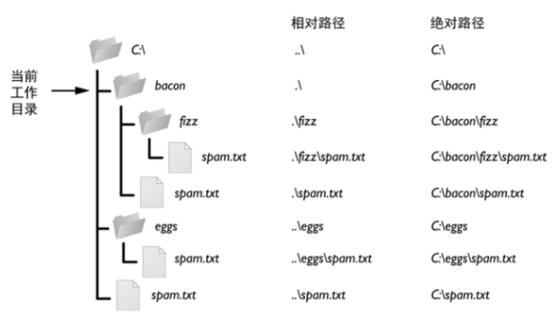

# Task 01 文件自动化处理

- [Task 01 文件自动化处理](#task-01-文件自动化处理)
  - [1.1文件处理](#11文件处理)
    - [1.1.1  文件与文件路径](#111--文件与文件路径)
    - [1.1.2  当前工作目录](#112--当前工作目录)
    - [1.1.3  路径操作](#113--路径操作)
      - [1.1.3.1 绝对路径和相对路径](#1131-绝对路径和相对路径)
      - [1.1.3.2 路径操作](#1132-路径操作)
      - [1.1.3.3 路径有效性检查](#1133-路径有效性检查)
    - [1.1.4  文件及文件夹操作](#114--文件及文件夹操作)
      - [1.1.4.1 用os.makedirs()创建新文件夹](#1141-用osmakedirs创建新文件夹)
      - [1.1.4.2 查看文件大小和文件夹内容](#1142-查看文件大小和文件夹内容)
    - [1.1.5 文件读写过程](#115-文件读写过程)
      - [1.1.5.1 用open()函数打开文件](#1151-用open函数打开文件)
      - [1.1.5.2 读取文件内容](#1152-读取文件内容)
      - [1.1.5.3 写入文件](#1153-写入文件)
      - [1.1.5.4 保存变量](#1154-保存变量)
    - [1.1.6 练习](#116-练习)
    - [1.1.7  组织文件](#117--组织文件)
      - [1.1.1.7.1 shutil模块](#11171-shutil模块)
      - [1.1.1.7.2 复制文件和文件夹](#11172-复制文件和文件夹)
      - [1.1.7.3 文件和文件夹的移动与改名](#1173-文件和文件夹的移动与改名)
      - [1.1.7.4 永久删除文件和文件夹](#1174-永久删除文件和文件夹)
      - [1.1.7.5 用send2trash模块安全地删除](#1175-用send2trash模块安全地删除)
    - [1.1.8 遍历目录树](#118-遍历目录树)
    - [1.1.9 用zipfile模块压缩文件](#119-用zipfile模块压缩文件)
      - [1.1.9.1 创建和添加到zip文件](#1191-创建和添加到zip文件)
      - [1.1.9.2 读取zip文件](#1192-读取zip文件)
      - [1.1.9.3 从zip文件中解压缩](#1193-从zip文件中解压缩)
    - [1.1.10 练习](#1110-练习)
  - [1.2 自动发送电子邮件](#12-自动发送电子邮件)

我们知道，程序运行时，可以用变量来保存运算结果，但如果希望程序运行关闭后，依然可以查看运行后的结果，就需要将数据保存到文件中。简单点，你可以将文件内容理解为一个字符串值，大小可能有几个GB。本节将学习，如何使用python在硬盘上创建、读取和保存文件。
## 1.1文件处理
### 1.1.1  文件与文件路径

文件的两个属性：“路径”和“文件名”，路径指明文件在计算机上的位置，文件名是指该位置的文件的名称。比如，我的电脑上，有个名字为Datawhale - 开源发展理论研究.pdf的文件，它的路径在D:\Datawhale。在windows中，路径中的D:\部分是“根文件夹”，Datawhale是文件夹名。注：Windows中文件夹名和文件名不区分大小写的。

在windows上，路径书写是使用倒斜杠'\'作为文件夹之间的分隔符，而在OS X和Linux上，是使用正斜杠'/'作为它们的路径分隔符。通常我们用`os.path.join()`函数来创建文件名称字符串。

```python
import os
os.path.join('Datawhale','docu')
```

我们可以看到返回的是（'Datawhale\\\docu'），有两个斜杠，这是因为有一个斜杠是用来转义的，在OS X或Linux上调用这个函数，这个字符串就会是'Datawhale/docu'。

### 1.1.2  当前工作目录

每个运行在计算机上的程序，都有一个“当前工作目录”。利用`os.getcwd()`函数，可以取得当前工作路径的
字符串，并可以利用`os.chdir()`改变它。

```python
import os
os.getcwd()          #获取当前工作目录
```

```python
os.chdir('D:\\Datawhale\\python办公自动化')          #改变当前工作目录
os.getcwd() 
```

### 1.1.3  路径操作

#### 1.1.3.1 绝对路径和相对路径

“绝对路径”，总是从根文件夹开始。
“相对路径”，相对于程序的当前工作目录。
相对路径中，单个句点“.”表示当前目录的缩写，两个句点“..”表示父文件夹。


几个常用的绝对路径和相对路径处理函数

`os.path.abspath(path)`：将相对路径转换为绝对路径，将返回参数的绝对路径的字符串。`os.path.isabs(path)`：判断是否是绝对路径，是返回True,不是则返回False

```python
os.path.abspath('.')   #当前路径转化为绝对路径。 'D:\\Datawhale\\python办公自动化'
os.path.isabs('.')        #False
os.path.isabs(os.path.abspath('.'))  #True
```

#### 1.1.3.2 路径操作

`os.path.relpath(path,start)`:返回从start路径到path的相对路径的字符串。如果没提供start,就使用当前工作目录作为开始路径。
`os.path.dirname(path)`: 返回当前路径的目录名称。
`os.path.basename(path)`：返回当前路径的文件名称。

```
os.path.relpath('D:\\Datawhale\\python办公自动化','D:\\')         #'Datawhale\\python办公自动化'
```

```
path = 'D:\\Datawhale\\python办公自动化\\python课程画图.pptx'  
os.path.dirname(path)     #'D:\\Datawhale\\python办公自动化'
```

```
os.path.basename(path)   #'python课程画图.pptx'
```

如果同时需要一个路径的目录名称和基本名称，可以调用`os.path.split()`，获得者两个字符串的元组。

```python
caFilePath = 'D:\\Datawhale\\python办公自动化\\python课程画图.pptx'
os.path.split(caFilePath)   #('D:\\Datawhale\\python办公自动化', 'python课程画图.pptx')
```

```
我们也可以调用os.path.dirname()和os.path.basename(),将它们的返回值放在一个元组中，从而得到同样的元组。
```

```python
(os.path.dirname(caFilePath),os.path.basename(caFilePath))  #('D:\\Datawhale\\python办公自动化', 'python课程画图.pptx')
```

如果我们想返回每个文件夹的字符串的列表。用`os.path.split()`无法得到，我们可以用`split()`字符串方法，并根据`os.path.sep` 中的字符串进行分割。`os.path.sep` 变量设置为正确的文件夹分割斜杠。

```python
caFilePath.split(os.path.sep)   #['D:', 'Datawhale', 'python办公自动化', 'python课程画图.pptx']
```

#### 1.1.3.3 路径有效性检查

如果提供的路径不存在，很多Python函数就会崩溃并报错。`os.path`模块提供了一些函数，用于检测给定的路径是否存在，以及判定是文件还是文件夹。

`os.path.exists(path)`：如果path参数所指的文件或文件夹存在，则返回True,否则返回False。

`os.path.isfile(path)`：如果path参数存在，并且是一个文件，则返回True,否则返回False。

`os.path.isdir(path)`：如果path参数存在，并且是一个文件夹，则返回True,否则返回False。

```python
os.path.exists('C:\\Windows')
```

```python
os.path.exists('C:\\else')
```

```python
os.path.isfile('D:\\Datawhale\\python办公自动化\\python课程画图.pptx')
```

```python
os.path.isfile('D:\\Datawhale\\python办公自动化')
```

```python
os.path.isdir('D:\\Datawhale\\python办公自动化\\python课程画图.pptx')
```

```python
os.path.isdir('D:\\Datawhale\\python办公自动化')
```

### 1.1.4  文件及文件夹操作

#### 1.1.4.1 用os.makedirs()创建新文件夹

注：`os.makedirs()`可以创建所有必要的中间文件夹。

```python
import os
os.makedirs('D:\\Datawhale\\practice')  #查看目录，已创建，若文件夹已存在，不会覆盖，会报错
```

#### 1.1.4.2 查看文件大小和文件夹内容

我们已经可以处理文件路径，这是操作文件及文件夹的基础。接下来，我们可以搜集特定文件和文件夹的信息。`os.path`模块提供了一些函数，用于查看文件的字节数以及给定文件夹中的文件和子文件夹。
`os.path.getsize(path)`：返回path参数中文件的字节数。
`os.listdir(path)`:返回文件名字符串的列表，包含path参数中的每个文件。

```python
os.path.getsize('D:\\Datawhale\\python办公自动化\\python课程画图.pptx')
```

```python
os.listdir('D:\\Datawhale\\python办公自动化')
```

如果想知道目录下所有文件的总字节数，可以同时使用`os.path.getsize()`和`os.listdir()`

```python
totalSize = 0
for filename in os.listdir('D:\\Datawhale\\python办公自动化'):
    totalSize = totalSize + os.path.getsize(os.path.join('D:\\Datawhale\\python办公自动化',filename))
print(totalSize)
```

### 1.1.5 文件读写过程

读写文件3个步骤：

1.调用`open()`函数，返回一个File对象。

2.调用File对象的`read()`或`write()`方法。

3.调用File对象的`close()`方法，关闭该文件。

#### 1.1.5.1 用open()函数打开文件

要用`open()`函数打开一个文件，就要向它传递一个字符串路径，表明希望打开的文件。这既可以是绝对路径，也可以是相对路径。`open()`函数返回一个File对象。
先用TextEdit创建一个文本文件，名为hello.txt。输入Hello World!作为该文本文件的内容，将它保存在你的用户文件夹中。

```python
helloFile = open('D:\\Datawhale\\python办公自动化\\hello.txt')
print(helloFile)
```

可以看到，调用`open()`函数将会返回一个File对象。当你需要读取或写入该文件，就可以调用helloFile变量中的File对象的方法。

#### 1.1.5.2 读取文件内容

有了File对象，我们就可以开始从它读取内容。

`read()`:读取文件内容。

`readlines()`:按行读取文件中的内容，取得一个字符串列表，列表中每个字符串是文本中的一行且以\n结束。

```python
helloContent = helloFile.read()
helloContent
```

```python
sonnetFile = open('D:\\Datawhale\\python办公自动化\\hello.txt')
sonnetFile.readlines()
```

#### 1.1.5.3 写入文件

需要用“写模式”‘w’和“添加模式”'a'打开一个文件，而不能用读模式打开文件。
“写模式”将覆写原有的文件，从头开始。“添加模式”将在已有文件的末尾添加文本。

```python
baconFile = open('bacon.txt','w')
baconFile.write('Hello world!\n')
```

```python
baconFile.close()  #注意，关闭后，才能完成写入，从txt文件中看到写入的内容。
```

```python
baconFile = open('bacon.txt','a')
baconFile.write('Bacon is not a vegetable.')
```

```python
baconFile.close() 
```

```python
baconFile = open('bacon.txt')
content = baconFile.read()
baconFile.close()
print(content)
```

注意，`write()`方法不会像print()函数那样，在字符串的末尾自动添加换行字符。必须自己添加该字符。

#### 1.1.5.4 保存变量

1)、shelve模块

用`shelve`模块，可以将Python中的变量保存到二进制的`shelf`文件中。这样，程序就可以从硬盘中恢复变量的数据。

```python
import shelve
shelfFile = shelve.open('mydata')
cats = ['Zonphie','Pooka','Simon']
shelfFile['cats'] = cats
shelfFile.close()
```

在Windows上运行前面的代码，我们会看到当前工作目录下有3个新文件：mydata.bak、mydata.dat和mydata.dir。在OS X上，只会创建一个mydata.db文件。

重新打开这些文件，取出数据。注意：`shelf`值不必用读模式或写模式打开，因为打开后，既能读又能写。

```python
shelfFile = shelve.open('mydata')
type(shelfFile)
```

```python
shelve.DbfilenameShelf
```

```python
shelfFile['cats']
```

```python
shelfFile.close()
```

就像字典一样，`shelf`值有`keys()`和`values()`方法，返回shelf中键和值的类似列表的值。但是这些方法返回类似列表的值，却不是真正的列表，所以应该将它们传递给`list()`函数，取得列表的形式。

```python
shelfFile = shelve.open('mydata')
list(shelfFile.keys())
```

```python
list(shelfFile.values())
```

```python
shelfFile.close()
```

2)、用`pprint.pformat()`函数保存变量

`pprint.pformat()`函数返回要打印的内容的文本字符串，这个字符串既易于阅读，也是语法上正确的Python代码。

假如，有一个字典，保存在一个变量中，希望保存这个变量和它的内容，以便将来使用。`pprint.pformat()`函数将提供一个字符串，我们可以将它写入.py文件。这个文件可以成为我们自己的模块，如果需要使用存储其中的变量，就可以导入它。

```python
import  pprint
cats = [{'name':'Zophie','desc':'chubby'},{'name':'Pooka','desc':'fluffy'}]
pprint.pformat(cats)
```

```python
fileObj = open('myCats.py','w')
fileObj.write('cats = '+pprint.pformat(cats)+'\n')
```

```python
fileObj.close()
```

import语句导入的模块本身就是Python脚本。如果来自pprint.pformat()的字符串保存为一个.py文件，该文件就是一个可以导入的模块。

```python
import myCats
myCats.cats
```

```python
myCats.cats[0]
```

```python
myCats.cats[0]['name']
```

### 1.1.6 练习

1、如果已有的文件以写模式打开，会发生什么？

2、`read()`和`readlines()`方法之间的区别是什么？

综合练习：
一、生成随机的测验试卷文件
假如你是一位地理老师， 班上有 35 名学生， 你希望进行美国各州首府的一个
小测验。不妙的是，班里有几个坏蛋， 你无法确信学生不会作弊。你希望随机调整
问题的次序， 这样每份试卷都是独一无二的， 这让任何人都不能从其他人那里抄袭答案。当然，手工完成这件事又费时又无聊。 好在， 你懂一些 Python。

下面是程序所做的事：

• 创建 35 份不同的测验试卷。

• 为每份试卷创建 50 个多重选择题，次序随机。

• 为每个问题提供一个正确答案和 3 个随机的错误答案，次序随机。

• 将测验试卷写到 35 个文本文件中。

• 将答案写到 35 个文本文件中。

这意味着代码需要做下面的事：

• 将州和它们的首府保存在一个字典中。

• 针对测验文本文件和答案文本文件，调用 open()、 write()和 close()。

• 利用 random.shuffle()随机调整问题和多重选项的次序。

### 1.1.7  组织文件

在上一节中，已经学习了如何使用Python创建并写入新文件。本节将介绍如何用程序组织硬盘上已经存在的文件。不知你是否经历过查找一个文件夹，里面有几十个、几百个、甚至上千个文件，需要手工进行复制、改名、移动或压缩。比如下列这样的任务：

• 在一个文件夹及其所有子文件夹中，复制所有的 pdf 文件（且只复制 pdf 文件）

• 针对一个文件夹中的所有文件，删除文件名中前导的零，该文件夹中有数百个文件，名为 spam001.txt、 spam002.txt、 spam003.txt 等。

• 将几个文件夹的内容压缩到一个 ZIP 文件中（这可能是一个简单的备份系统）

所有这种无聊的任务，正是在请求用 Python 实现自动化。通过对电脑编程来完成这些任务，你就把它变成了一个快速工作的文件职员，而且从不犯错。

#### 1.1.1.7.1 shutil模块

`shutil`(或称为shell工具)模块中包含一些函数，可以在Python程序中复制、移动、改名和删除文件。要使用`shutil`的函数，首先需要`import shutil`

#### 1.1.1.7.2 复制文件和文件夹

`shutil.copy(source, destination)`：将路径source处的文件复制到路径 destination处的文件夹（source 和 destination 都是字符串），并返回新复制文件绝对路径字符串。

其中destination可以是：

1）、一个文件的名称，则将source文件复制为新名称的destination

2）、一个文件夹，则将source文件复制到destination中

3）、若这个文件夹不存在，则将source目标文件内的内容复制到destination中,若destination文件夹不存在，则自动生成该文件。(慎用，因为会将source文件复制为一个没有扩展名的名字为destination的文件，这往往不是我们希望的)

```python
import shutil
shutil.copy('D:\\Datawhale\\python办公自动化\\bacon.txt', 'D:\\Datawhale\\practice')
```

```python
os.getcwd()
```

```python
shutil.copy('D:\\Datawhale\\python办公自动化\\capitalsquiz_answers1.txt', 'D:\\Datawhale\\practice\\bacon.txt')
```

```python
shutil.copy('D:\\Datawhale\\python办公自动化\\bacon.txt', 'D:\\Datawhale\\exercise')
```

`shutil.copytree(source, destination)` :将路径source处的文件夹，包括其包含的文件夹和文件，复制到路径destination处的文件夹,并返回新复制文件夹绝对路径字符串。

注：destination处的文件夹为新创建的文件夹，如已存在，则会报错

```python
import shutil
shutil.copytree('D:\\Datawhale\\python办公自动化','D:\\Datawhale\\practice')
```

#### 1.1.7.3 文件和文件夹的移动与改名

`shutil.move(source, destination)`：将路径 source 处的文件/文件夹移动到路径destination，并返回新位置的绝对路径的字符串。

1)、如果source和destination是文件夹，且destination已存在，则会将source文件夹下所有内容复制到destination文件夹中。移动。

2）、如果source是文件夹，destination不存在，则会将source文件夹下所有内容复制到destination文件夹中，source原文件夹名称将被替换为destination文件夹名。   移动+重命名

3）、如果source和destination是文件，source处的文件将被移动到destination处的位置，并以destination处的文件名进行命名，移动+重命名。

注意：如果destination中有原来已经存在同名文件，移动后，会被覆写，所以应当特别注意。

```python
import shutil
shutil.move('D:\\Datawhale\\practice','D:\\Datawhale\\docu')
```

```python
shutil.move('D:\\Datawhale\\practice','D:\\Datawhale\\docue')
```

```python
shutil.move('D:\\Datawhale\\docue\\bacon.txt','D:\\Datawhale\\docu\\egg.txt')
```

#### 1.1.7.4 永久删除文件和文件夹

`os.unlink(path)`: 删除path处的文件。

`os.rmdir(path)`: 删除path处的文件夹。该文件夹必须为空，其中没有任何文件和文件夹。

`shutil.rmtree(path)`:删除 path 处的文件夹，它包含的所有文件和文件夹都会被删除。

注意：使用时，需要非常小心，避免删错文件，一般在第一次运行时，注释掉这些程序，并加上`print()`函数来帮助查看是否是想要删除的文件。

```python
#建议先指定操作的文件夹，并查看
os.chdir('D:\\Datawhale\\docue')
os.getcwd()
```

```python
import os
for filename in os.listdir():
    if filename.endswith('.dir'):
        #os.unlink(filename)
        print(filename)
```

#### 1.1.7.5 用send2trash模块安全地删除

`shutil.rmtree(path)`会不可恢复的删除文件和文件夹，用起来会有危险。因此使用第三方的`send2trash`模块，可以将文件或文件夹发送到计算机的垃圾箱或回收站，而不是永久删除。因程序缺陷而用send2trash 删除的某些你不想删除的东西，稍后可以从垃圾箱恢复。

注意：使用时，需要非常小心，避免删错文件，一般在第一次运行时，注释掉这些程序，并加上`print()`函数来帮助查看是否是想要删除的文件。

```python
pip install send2trash       #安装send2trash模块
```

```python
import send2trash
send2trash.send2trash('bacon.txt')
```

### 1.1.8 遍历目录树

 `os.walk(path)`:传入一个文件夹的路径，在for循环语句中使用`os.walk()`函数，遍历目录树，和range()函数遍历一个范围的数字类似。不同的是，`os.walk()`在循环的每次迭代中，返回三个值：

 1）、当前文件夹称的字符串。

 2）、当前文件夹中子文件夹的字符串的列表。

 3）、当前文件夹中文件的字符串的列表。

 注：当前文件夹，是指for循环当前迭代的文件夹。程序的当前工作目录，不会因为`os.walk()`而改变。


按照下图目录树，创建相应的文件。


```python
import os
for folderName, subFolders,fileNames in os.walk('D:\\animals'):
    print('The current folder is ' + folderName)
    for subFolder in subFolders:
        print('Subfolder of '  + folderName+':'+subFolder)
    for filename in fileNames:
        print('File Inside '  + folderName+':'+filename)
    print('')   
```

### 1.1.9 用zipfile模块压缩文件

为方便传输，常常将文件打包成.zip格式文件。利用zipfile模块中的函数，Python程序可以创建和打开（或解压）zip文件。

#### 1.1.9.1 创建和添加到zip文件

将上述章节中animals文件夹进行压缩。创建一个example.zip的zip文件，并向其中添加文件。

`zipfile.ZipFile('filename.zip', 'w')` ：以写模式创建一个压缩文件

`ZipFile` 对象的 `write('filename','compress_type=zipfile.ZIP_DEFLATED')`方法：如果向`write()`方法中传入一个路径，Python 就会压缩该路径所指的文件， 将它加到 ZIP 文件中。 如果向`write()`方法中传入一个字符串，代表要添加的文件名。第二个参数是“压缩类型”参数，告诉计算机用怎样的算法来压缩文件。可以总是将这个值设置为 `zipfile.ZIP_DEFLATED`（这指定了 deflate 压缩算法，它对各种类型的数据都很有效）。

注意：写模式会擦除zip文件中所有原有的内容。如果只希望将文件添加到原有的zip文件中，就要向`zipfile.ZipFile()`传入'a'作为第二个参数，以添加模式打开 ZIP 文件。

```python
## 1 创建一个new.zip压缩文件，并向其中添加文件
import zipfile
newZip = zipfile.ZipFile('new.zip','w')
newZip.write('Miki.txt',compress_type=zipfile.ZIP_DEFLATED)
newZip.close()
```

```python
newZip = zipfile.ZipFile('new.zip','w')
newZip.write('D:\\animals\\dogs\\Taidi.txt',compress_type=zipfile.ZIP_DEFLATED)
newZip.close()
```

```python
## 2 创建一个example.zip的压缩文件，将animals文件夹下所有文件进行压缩。
import zipfile
import os
newZip = zipfile.ZipFile('example.zip','w')
for folderName, subFolders,fileNames in os.walk('D:\\animals'):
    for filename in fileNames:
        newZip.write(os.path.join(folderName,filename),compress_type=zipfile.ZIP_DEFLATED)
newZip.close()
```

#### 1.1.9.2 读取zip文件

调用`zipfile.ZipFile(filename)`函数创建一个`ZipFile`对象（注意大写字母Z和F）,filename是要读取zip文件的文件名。

`ZipFile`对象中的两个常用方法：

`namelis()`方法，返回zip文件中包含的所有文件和文件夹的字符串列表。

`getinfo()`方法，返回一个关于特定文件的`ZipInfo`对象。

`ZipInfo`对象的两个属性：`file_size`和`compress_size`，分别表示原来文件大小和压缩后文件大小。1.2.3.2 读取zip文件

```
import zipfile,os
exampleZip = zipfile.ZipFile('example.zip')
exampleZip.namelist()
```

```
catInfo = exampleZip.getinfo('animals/Miki.txt')
```

```
catInfo.file_size
```

```
catInfo.compress_size
```

```
print('Compressed file is %s x smaller!' %(round(catInfo.file_size/catInfo.compress_size,2)))
```

```
exampleZip.close()
```

#### 1.1.9.3 从zip文件中解压缩

`ZipFile` 对象的 `extractall()`方法：从zip文件中解压缩所有文件和文件夹，放到当前工作目录中。也可以向`extractall()`传递的一个文件夹名称，它将文件解压缩到那个文件夹， 而不是当前工作目录。如果传递的文件夹名称不存在，就会被创建。

`ZipFile` 对象的 `extract()`方法:从zip文件中解压单个文件。也可以向 extract()传递第二个参数， 将文件解压缩到指定的文件夹， 而不是当前工作目录。如果第二个参数指定的文件夹不存在， Python 就会创建它。extract()的返回值是被压缩后文件的绝对路径。

```python
import zipfile, os
exampleZip = zipfile.ZipFile('example.zip')
exampleZip.extractall('.\zip')
exampleZip.close()
```

```python
exampleZip = zipfile.ZipFile('example.zip')
exampleZip.extract('animals/Miki.txt')
exampleZip.extract('animals/Miki.txt', 'D:\\animals\\folders')
exampleZip.close()
```

### 1.1.10 练习

1）、编写一个程序，遍历一个目录树，查找特定扩展名的文件（诸如.pdf 或.jpg）。不论这些文件的位置在哪里， 将它们拷贝到一个新的文件夹中。

2） 、一些不需要的、 巨大的文件或文件夹占据了硬盘的空间， 这并不少见。如果你试图释放计算机上的空间， 那么删除不想要的巨大文件效果最好。但首先你必须找到它们。编写一个程序， 遍历一个目录树， 查找特别大的文件或文件夹， 比方说， 超过100MB 的文件（回忆一下，要获得文件的大小，可以使用 os 模块的 `os.path.getsize()`）。将这些文件的绝对路径打印到屏幕上。

3）、编写一个程序， 在一个文件夹中， 找到所有带指定前缀的文件， 诸如 spam001.txt,spam002.txt 等，并定位缺失的编号（例如存在 spam001.txt 和 spam003.txt， 但不存在 spam002.txt）。让该程序对所有后面的文件改名， 消除缺失的编号。作为附加的挑战，编写另一个程序，在一些连续编号的文件中，空出一些编号，以便加入新的文件。

## 1.2 自动发送电子邮件

使用Python实现自动化邮件发送，可以让你摆脱繁琐的重复性业务，节省非常多的时间。

Python有两个内置库：`smtplib`和`email`，能够实现邮件功能，`smtplib`库负责发送邮件，`email`库负责构造邮件格式和内容。

邮件发送需要遵守**SMTP**协议，Python内置对SMTP的支持，可以发送纯文本邮件、HTML邮件以及带附件的邮件。

```python
#1 先导入相关的库和方法
import smtplib  #导入库
from smtplib import SMTP_SSL  #加密邮件内容，防止中途被截获
from email.mime.text import  MIMEText   #构造邮件的正文
from email.mime.image import MIMEImage  #构造邮件的图片
from email.mime.multipart import MIMEMultipart   #把邮件的各个部分装在一起，邮件的主体
from email.header import Header   #邮件的文件头，标题，收件人
```

```python
#2 设置邮箱域名、发件人邮箱、邮箱授权码、收件人邮箱
host_server = 'smtp.163.com' #sina 邮箱smtp服务器                 #smtp 服务器的地址
sender_163 = 'pythonauto_emai@163.com'                   #sender_163为发件人的邮箱
pwd = 'DYEPOGLZDZYLOMRI'                    #pwd为邮箱的授权码'DYEPOGLZDZYLOMRI'
#也可以自己注册个邮箱，邮箱授权码'DYEPOGLZDZYLOMRI' 获取方式可参考#http://help.163.com/14/0923/22/A6S1FMJD00754KNP.html
receiver = '********@163.com'      
```

```python
#3 构建MIMEMultipart对象代表邮件本身，可以往里面添加文本、图片、附件等
msg = MIMEMultipart()    #邮件主体
```

```python
#4 设置邮件头部内容
mail_title = 'python办公自动化邮件'   # 邮件标题
msg["Subject"] = Header(mail_title,'utf-8')  #装入主体
msg["From"] = sender_163           #寄件人
msg["To"] = Header("测试邮箱",'utf-8') #标题
```

```python
#5 添加正文文本
mail_content = "您好，这是使用python登录163邮箱发送邮件的测试"   #邮件的正文内容
message_text = MIMEText(mail_content,'plain','utf-8')   #构造文本,参数1：正文内容，参数2：文本格式，参数3：编码方式
msg.attach(message_text)    # 向MIMEMultipart对象中添加文本对象
```

```python
#6 添加图片
image_data = open('cat.jpg','rb')   # 二进制读取图片
message_image = MIMEImage(image_data.read())  # 设置读取获取的二进制数据
image_data.close()       # 关闭刚才打开的文件
msg.attach(message_image)  # 添加图片文件到邮件信息当中去
```

```python
# 7 添加附件(excel表格)
atta = MIMEText(open('cat.xlsx', 'rb').read(), 'base64', 'utf-8')   # 构造附件
atta["Content-Disposition"] = 'attachment; filename="cat.xlsx"'  # 设置附件信息
msg.attach(atta)       ## 添加附件到邮件信息当中去
```

```python
#8 发送邮件
smtp = SMTP_SSL(host_server)       #SSL登录  创建SMTP对象
smtp.login(sender_163,pwd)         ## 登录邮箱，传递参数1：邮箱地址，参数2：邮箱授权码
smtp.sendmail(sender_163,receiver,msg.as_string()) # 发送邮件，传递参数1：发件人邮箱地址，参数2：收件人邮箱地址，参数3：把邮件内容格式改为str
print("邮件发送成功")
smtp.quit         # 关闭SMTP对象
```

