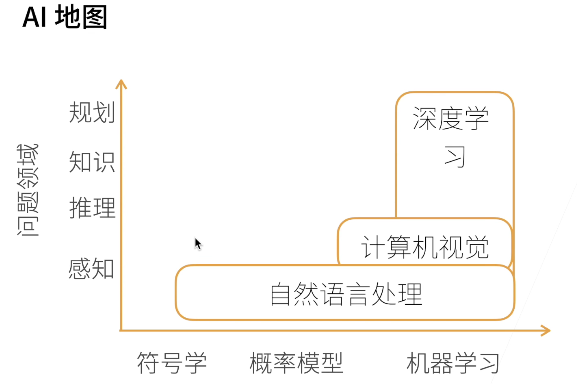
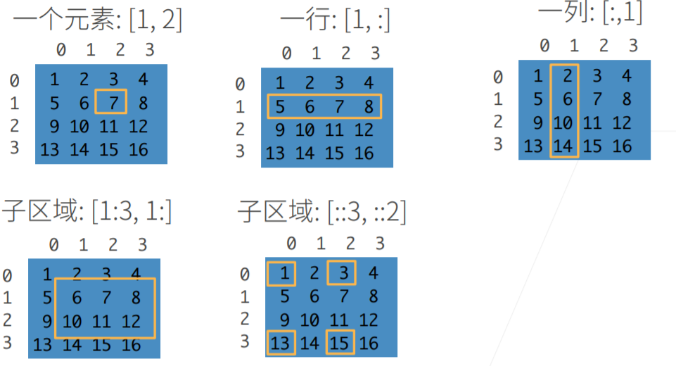

# 动手学深度学习

> 之前学习深度学习和机器学习看的很杂，很多概念都没有好好理解到位。计算机领域更加强调知行合一。这里记录一下学习李沐的学习过程，希望可以帮助自己提升个人的学业水平、整理总结能力、coding能力。

### 深度学习的介绍

过去十年最热的方向，也是本次学习的重点。利用机器学习处理NLP、CV领域。$x$轴代表随着时间的推移，处理方法的变化。$y$轴代表 其处理范围的不同，可以看出不断沿着AI的方向发展。

应用领域及其广泛，比如图片分类、风格迁移、广告推荐等

当前深度学习处理领域职业主要可分为：数据科学家、AI专家、领域专家

##### Q & A

1. 在机器学习的图片分割领域，为什么有效，模型的可解释性怎么样？

   - 对于DL，这一方面做的不太好，相当于"黑盒"
   - 对于ML，有些模型有一定的解释性。
   - 有效和可解释性不一样。针对特定的模型，在一个特定领域运用会有特定的解释，比如考虑空间信息，时间信息。可解释性目前比较欠缺，有待学术上的进一步进展。

2.  深度学习不能用数学表述，只能使用直觉理解是吗

   这个是不一定的，有些部分开始数学进行表示。但是目前来说使用数学进行表示，是做的不太好的地方。

3.  符号学会应用在深度学习中吗？

   会的，在比较复杂的深度学习模型，现在会用到部分符号学的推理。

4. mac是否可以使用pytorch

   mac可以使用，但是目前不可以使用gpu来操作pytorch

5. 如何寻找自己领域paper？

   后面会专门介绍

6. 无人驾驶在深度学习的应用

   无人驾驶属于错误了一次，造成后果很严重的领域。目前使用深度学习是多模型的融合。

### 动手安装

学习最高境界——实践教学

李沐老师这里是使用Amazon云安装

[视频安装教程](https://zh-v2.d2l.ai/chapter_installation/index.html)

### 数据操作

N维数组样列

- 1维：标量
- 2维：向量
- 3维：RGB图片(宽x高x通道)
- 4维：一个RGB图片批量(批量大小x宽x高x通道)
- 5维：一个视频的批量（批量大小x时间x宽x高x通道)

创建数组：

最后一个代表：行是三行一跳，列是2列一跳

代码操作：

